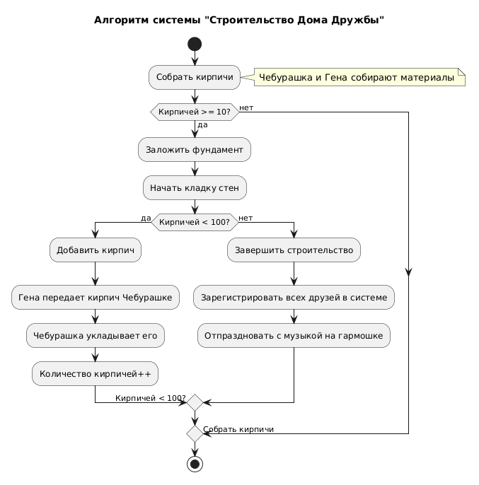

# Activity Diagram: Алгоритм системы "Строительство Дома Дружбы"

## Обзор

Эта диаграмма активности показывает алгоритм работы системы строительства "Дома Дружбы".

## Характеристика процесса

### Шаг 1: Сбор материалов
- Чебурашка и Гена собирают кирпичи
- Проверка: кирпичей >= 10?
- **Нет** - Продолжают сбор (возврат к началу)

### Шаг 2: Начало строительства
- **Да** - Закладка фундамента
- Начало кладки стен

### Шаг 3: Основной цикл строительства
- Проверка: кирпичей < 100?
- **Да** - Добавить кирпич, Гена передает, Чебурашка укладывает, возврат к проверке
- **Нет** - Завершение строительства

### Шаг 4: Финал
- Зарегистрировать всех друзей в системе
- Отпраздновать с музыкой на гармошке

## Точки принятия решений

| Условие | Результат |
|---------|----------|
| Кирамита >= 10? | Если да → закладка фундамента. Если нет → продолжать сбор |
| Кирамита < 100? | Если да → добавить кирпич. Если нет → завершить строительство |

## Диаграмма



```
@startuml
skinparam conditionStyle inside
title Алгоритм системы "Строительство Дома Дружбы"

start

:Собрать кирпичи;
note right: Чебурашка и Гена собирают материалы

if (Кирпичей >= 10?) then (да)
    :Заложить фундамент;
    :Начать кладку стен;
    
    if (Кирпичей < 100?) then (да)
        :Добавить кирпич;
        :Гена передает кирпич Чебурашке;
        :Чебурашка укладывает его;
        :Количество кирпичей++;
        -> Кирпичей < 100?;
    else (нет)
        :Завершить строительство;
        :Зарегистрировать всех друзей в системе;
        :Отпраздновать с музыкой на гармошке;
    endif
else (нет)
    -> Собрать кирпичи;
endif

stop
@enduml
