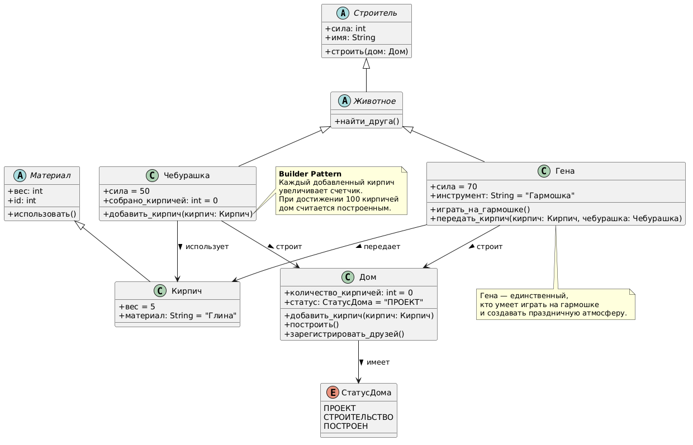

# Class Diagram: Строительство Дома Дружбы

## Классы

| Класс | Атрибуты | Методы | Назначение |
|-------|----------|--------|------------|
| **Чебурашка** | сила: int, собрано_кирпичей: int | найти_друга(), добавить_кирпич(кирпич), праздновать() | Главный строитель, инициатор действий |
| **Гена** | инструмент: string | играть_на_гармошке(), передать_кирпич(кирпич, чебурашка), найти_друга() | Помощник, поставляет ресурсы, создает атмосферу |
| **Кирпич** | id: int, вес: int | использовать() | Строительный материал |
| **Дом** | количество_кирпичей: int, статус: СтатусДома | добавить_кирпич(кирпич), построить(), зарегистрировать_друзей() | Целевой объект строительства |
| **СтатусДома** | - | - | Перечисление состояний жизненного цикла |

## Связи

- **Чебурашка** → **Кирпич**: использует
- **Гена** → **Кирпич**: передает
- **Чебурашка** → **Дом**: строит
- **Гена** → **Дом**: строит
- **Дом** → **СтатусДома**: имеет

## Диаграмма


```
@startuml
class Чебурашка {

сила: int

собрано_кирпичей: int

найти_друга()

добавить_кирпич(кирпич: Кирпич)

праздновать()
}

class Гена {

инструмент: string

играть_на_гармошке()

передать_кирпич(кирпич: Кирпич, чебурашка: Чебурашка)

найти_друга()
}

class Кирпич {

id: int

вес: int

использовать()
}

class Дом {

количество_кирпичей: int

статус: СтатусДома

добавить_кирпич(кирпич: Кирпич)

построить()

зарегистрировать_друзей()
}

enum СтатусДома {
ПРОЕКТ
СТРОИТЕЛЬСТВО
ПОСТРОЕН
}

Чебурашка --> Кирпич : использует
Гена --> Кирпич : передает
Чебурашка --> Дом : строит
Гена --> Дом : строит
Дом --> СтатусДома : имеет
@enduml
```
text

## Описание

Эта диаграмма классов иллюстрирует объектно-ориентированную структуру системы «Строительство Дома Дружбы»:

1. **Чебурашка** и **Гена** — главные акторы, которые взаимодействуют с кирпичами и домом
2. **Кирпич** — базовый строительный материал, которым оперируют герои
3. **Дом** — целевой объект, который имеет статус строительства (Проект → Строительство → Построен)
4. **СтатусДома** — перечисление, определяющее жизненный цикл дома

Связи показывают, что Чебурашка и Гена используют кирпичи для строительства дома, а дом имеет определенный статус.
