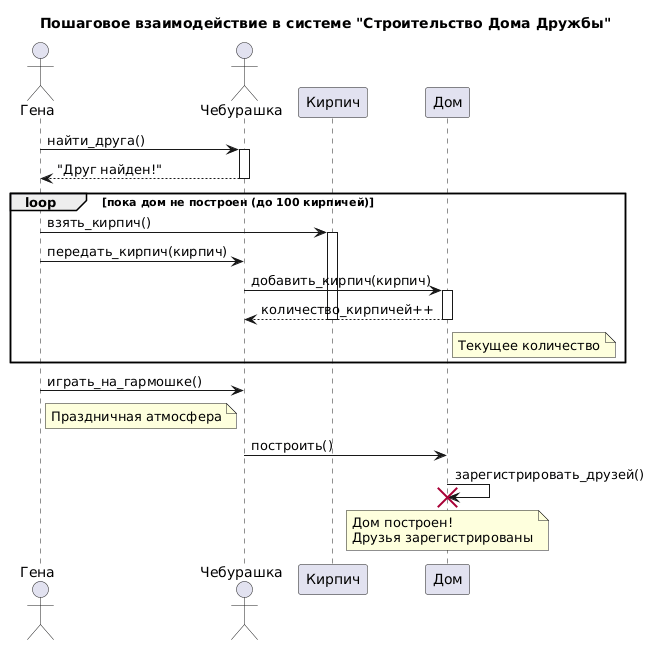

# Sequence Diagram: Взаимодействие в системе "Строительство Дома Дружбы"

## Обзор

Эта диаграмма последовательности показывает пошаговое взаимодействие между актерами и объектами в системе строительства "Дома Дружбы".

## Актеры и участники

| Актер/Участник | Описание |
|-------------------|-------------|
| Гена | Крокодил, передает кирпичи, играет на гармошке |
| Чебурашка | Главный строитель, укладывает кирпичи |
| Кирамит | Строительный материал |
| Дом | Строящийся объект |

## Шаги взаимодействия

### Шаг 1: Поиск друга
- Гена находит Чебурашку
- Чебурашка подтверждает: "Друг найден!"

### Шаг 2: Основной цикл строительства (повторяется до 100 кирпичей)
- Гена берет кирпич
- Гена передает кирпич Чебурашке
- Чебурашка добавляет кирпич к дому
- Дом увеличивает счетчик кирпичей

### Шаг 3: Завершение строительства
- Гена играет на гармошке
- Чебурашка инициирует завершение строительства
- Дом регистрирует всех друзей в системе

## Ключевые наблюдения

1. Гена выступает как поставщик материалов (передает кирпичи)
2. Чебурашка выступает как строитель (укладывает кирпичи)
3. Дом отслеживает количество кирпичей
4. После достижения 100 кирпичей дом завершает строительство
5. Гена создает праздничную атмосферу игрой на гармошке

## Диаграмма



```plantuml
@startuml
title Пошаговое взаимодействие в системе "Строительство Дома Дружбы"

actor "Гена" as Gena
actor "Чебурашка" as Cheb
participant "Кирпич" as Brick
participant "Дом" as House

' 1. Поиск друга
Gena -> Cheb : найти_друга()
activate Cheb
Cheb --> Gena : "Друг найден!"
deactivate Cheb

' 2. Основной цикл строительства
loop пока дом не построен (до 100 кирпичей)
    Gena -> Brick : взять_кирпич()
    activate Brick
    Gena -> Cheb : передать_кирпич(кирпич)
    Cheb -> House : добавить_кирпич(кирпич)
    activate House
    House --> Cheb : количество_кирпичей++
    note right of House : Текущее количество
    deactivate House
    deactivate Brick
end

' 3. Завершение строительства
Gena -> Cheb : играть_на_гармошке()
note right of Gena : Праздничная атмосфера
Cheb -> House : построить()
House -> House : зарегистрировать_друзей()
destroy House
note over House : Дом построен!\nДрузья зарегистрированы

@enduml
