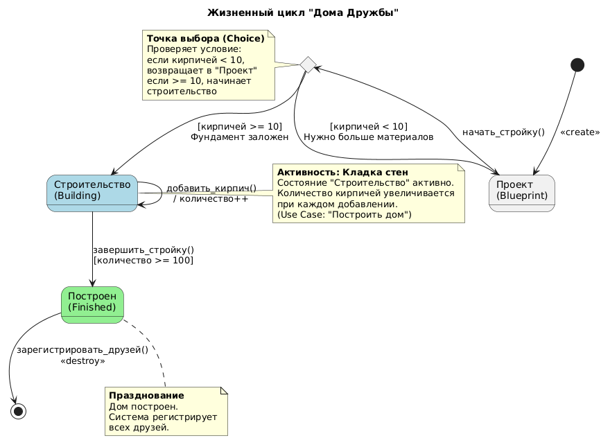

# State Diagram: Жизненный цикл Дома Дружбы

## Обзор

Эта диаграмма состояний показывает жизненный цикл Дома Дружбы от проекта до готового здания.

## Состояния

| Состояние | Описание | Цвет |
|-------|-------------|------------------|
| План (Blueprint) | Дом существует только на чертеже | Default |
| Строительство (Building) | Идет активная кладка стен | Light Blue |
| Сооружён (Finished) | Дом полностью построен | Light Green |

## Переходы состояний

### Начальное состояние
- [*] --> Проект : <<create>>

### Переход: начать_стройку()
- Из Проект в точку выбора (c)

### Логика точки выбора
| Условие | Следующее состояние |
|-----------|------------|
| кирпичей < 10 | Проект (Нужно больше материалов) |
| кирпичей >= 10 | Строительство (Фундамент заложен) |

### Самопереход в Строительстве
- Строительство --> Строительство : добавить_кирпич() / количество++

### Завершение строительства
- Строительство --> Построен : завершить_стройку() [количество >= 100]

### Конечное состояние
- Построен --> [*] : зарегистрировать_друзей() <<destroy>>

## Ключевые моменты

- **Точка выбора (c)**: Проверяет количество кирпичей
  - Если кирпичей < 10, возвращает в "Проект"
  - Если кирпичей >= 10, переходит в "Строительство"

- **Самопереход**: В состоянии "Строительство" можно многократно добавлять кирпичи
- **Условие завершения**: Для завершения нужно 100 кирпичей
- **Финальное действие**: После постройки происходит регистрация друзей

## Диаграмма



```
@startuml
skinparam state {
  BackgroundColor<<Построен>> #lightgreen
  BackgroundColor<<Строительство>> #lightblue
}

title Жизненный цикл "Дома Дружбы"

[*] --> Проект : <<create>>

state "Проект\n(Blueprint)" as Проект
state "Строительство\n(Building)" as Строительство <<Строительство>>
state "Построен\n(Finished)" as Построен <<Построен>>
state c <<choice>> 

' Все воздействия идут в точку принятия решения
Проект --> c : начать_стройку()

' Логика распределения потоков
c --> Проект : [кирпичей < 10]\nНужно больше материалов
c --> Строительство : [кирпичей >= 10]\nФундамент заложен

' Процесс добавления кирпичей (петля)
Строительство --> Строительство : добавить_кирпич()\n/ количество++

' Завершение строительства
Строительство --> Построен : завершить_стройку()\n[количество >= 100]

' Финал
Построен --> [*] : зарегистрировать_друзей()\n<<destroy>>

note left of c
  **Точка выбора (Choice)**
  Проверяет условие:
  если кирпичей < 10, 
  возвращает в "Проект"
  если >= 10, начинает
  строительство
end note

note right of Строительство
  **Активность: Кладка стен**
  Состояние "Строительство" активно.
  Количество кирпичей увеличивается
  при каждом добавлении.
  (Use Case: "Построить дом")
end note

note bottom of Построен
  **Празднование**
  Дом построен.
  Система регистрирует
  всех друзей.
end note

@enduml
